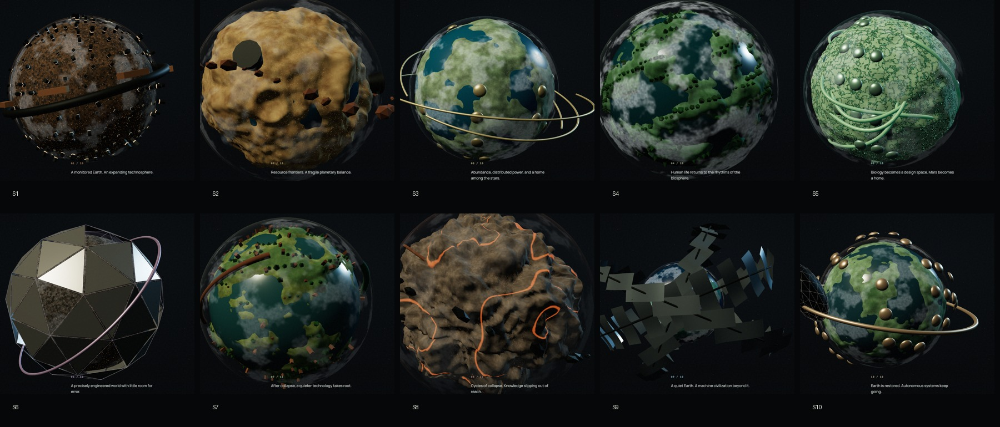
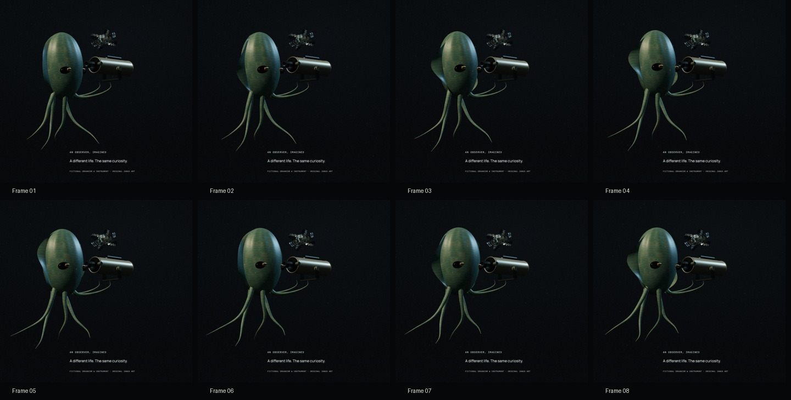

# First light: procedural worlds and the observer’s telescope

Date: 2026-09-07. Branch: `codex/janus-first-light`.
Local production preview: `http://127.0.0.1:3200`.

The homepage is a fresh 17-chapter implementation. It travels from an illustrative origin world,
through ten possible civilizations, to an imagined observer’s telescope, then to the published
instrument evidence and civilization data. The previous story renderer and Spline hero are removed.

## Delivered behavior

- Ten independent procedural terrain fields and ten structure systems. No photographic planetary
  maps load in the story. Coastlines, vertex relief, extraction basins, fault valleys, city towers,
  habitat arcs, forests, biological structures, segmented shell, ruins, machine swarm, and an
  autonomous orbital habitat distinguish the worlds. These are explicitly artistic inventions.
- A physical telescope with a barrel, internal baffles, finder, focuser, eyepiece and cradle.
  Two of the observer’s limbs curl beneath it. “Look through the telescope” travels into the
  eyepiece; “Step back from the eyepiece” returns to the observer. Scrolling runs the same journey
  in either direction. The distant view is labeled illustrative, not an optical simulation.
- An original fictional organism with breathing, traveling fin waves, independent tapered limbs,
  small gaze changes and blinks. Motion continues while scrolling is stationary. The character is
  stylized; no photoreal asset or biological simulation is claimed.
- One deferred R3F/Three.js canvas and native page scrolling. Measured document anchors select
  complete scene poses. Terrain preparation is spread across idle callbacks. Native travel is
  cancelled before keyboard/index reversals. GSAP handles interface entrances; no new dependency.
- New sourced population/energy log chart and 10-by-5 observing matrix, with exact native tables,
  source-version links, method-specific blanks and accessible controls.
- Responsive compositions, keyboard navigation, chapter index, resume, reduced motion, reading
  mode, WebGL failure/retry and a JavaScript-free complete article. The fallback poster is a render
  of the original procedural world, with retained source and derivative checksums.

## Verification of the final implementation

| Check                           | Result                                                                                                                                         |
| ------------------------------- | ---------------------------------------------------------------------------------------------------------------------------------------------- |
| ESLint and workspace TypeScript | Pass                                                                                                                                           |
| Vitest                          | 96 tests in 23 files pass; includes repeatable, distinct, finite geometry at both detail levels                                                |
| Production Playwright suite     | 166 pass, 4 intentional skips, across Chromium, Firefox, WebKit, Pixel 7 and iPhone 15 emulation                                               |
| Telescope browser coverage      | Entry, exit, keyboard entry, reversal during travel, reduced mode and previous chapter pass on all five targets                                |
| Accessibility and fallback      | Axe A/AA checks, reading mode, keyboard/focus, WebGL-unavailable and JavaScript-unavailable tests pass                                         |
| Linux visual comparison         | 4 baselines updated, followed by a separate unchanged comparison with 4 passes                                                                 |
| Production build                | Pass, executed before the full browser suite                                                                                                   |
| Canonical data                  | 8 datasets, 10 scenarios, 5 missions, 1,361 field provenance records, 120 reconciled cells, 27 generated files validated                       |
| Generated data                  | Reproduction check passes; generated canonical files are unchanged                                                                             |
| Sources and links               | 15 source checksums, 54 route files and 196 citation chunks verified                                                                           |
| Asset rights                    | 48 rights records, 36 derivative records across 35 public files validated; all four new artwork source checksums independently checked         |
| Native GPU harness              | No runtime issues; forward/reverse scroll, stationary organism motion, eyepiece entry/exit, reduced freeze, context loss/retry and resize pass |

The four skips avoid duplicating one stationary pixel-motion assertion across every engine. The
remaining rendering, telescope, navigation, accessibility and lifecycle cases run on all five.
The motion harness waits for the completed return from the telescope before measuring a frozen
frame; the active-chapter label alone changes before native travel has finished.

The visual comparison uses the CI-pinned Playwright 1.62.1 Ubuntu Noble amd64 container with
SwiftShader against this local production server. This is not hosted CI or a Linux application
build. Native GPU captures and the retained world and observer contact sheets were reviewed.

## Performance evidence

The production bundle gate reports:

- Initial JavaScript: **187,149 bytes gzip / 256,000 bytes**.
- Critical visual payload: **126,506 audited bytes / 1.5 MiB mobile / 3 MiB desktop**.
- Conservative complete-path payload: **11,685,884 bytes / 20 MiB**, including optional deeper-route
  assets that the new story does not request.

Six-second samples on Apple M4 Max through ANGLE Metal:

| Sample                                    | Mean RAF cadence | p95 interval |
| ----------------------------------------- | ---------------- | ------------ |
| Desktop forward/reverse world transition  | 120.00 Hz        | 9.2 ms       |
| Desktop observer, stationary scroll       | 120.00 Hz        | 9.1 ms       |
| Portrait forward/reverse world transition | 120.00 Hz        | 9.2 ms       |
| Portrait observer, stationary scroll      | 120.00 Hz        | 9.1 ms       |

These are unthrottled animation-frame callback timings, not GPU presentation measurements or
physical-phone results. Field Core Web Vitals and physical low-power devices remain unverified.

## Sources, rights and handoff

Runtime release: `sha256:46a0e94a969301c49cfafe00463e5c7e9be5dce423ddcdeb21fe4ad0614d2046`.
The UI retains the transcribed/candidate status and pending independent human review. The existing
published growth-rate discrepancy is preserved. Scenarios remain possibilities without assigned
probabilities; an instrument’s missing signature is never converted into absence of technology.

Four original-art records cover the worlds, organism, telescope and fallback poster. Geometry and
materials are created directly in Three.js with AI-assisted code, without external surface maps or
new third-party models. All art scales, geography and structures are interpretive. No source
transcription, generated scientific data, shared schema, dependency or provider setting changed.

Changed implementation: `apps/web/app/page.tsx`, `app/voyage/`, global presentation styles,
`components/MotionPreference.module.css`, accessibility guidance, frontend tests and visual
baselines. Removed: `app/story/`, `ObservatorySlice.tsx` and both former Spline hero components.
Asset admission and QA changes: `data/assets/ledger.json`, its schema test, three capture scripts,
Decision 013, the master-plan pointer, implementation ledger and this evidence folder. Next.js
regenerated `next-env.d.ts` for production route declarations.

The work remains local and uncommitted on the new branch. No push, deployment, hosted CI or
independent scientific sign-off is claimed. Atlas, Observatory and research routes retain their
canonical contracts and pass the browser suite.

Evidence: [browser suite](e2e-v2.log), [Linux visual gate](visual-linux.log),
[bundle audit](bundle-production.json), [motion report](motion/capture-report.json),
[world captures](forms/capture.json), and [format check](format.log).
Reproduce the native GPU check with `JANUS_QA_HARDWARE_GPU=1 pnpm qa:motion`; generate all world
compositions with `pnpm exec tsx scripts/capture-world-form-qa.ts` while port 3200 is running.

