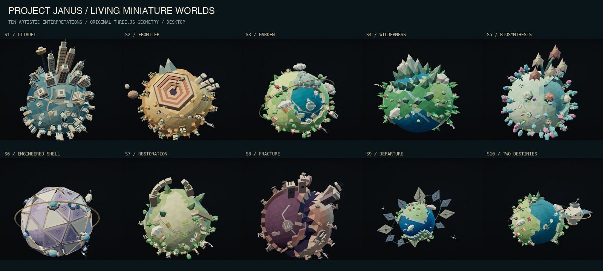

# Janus living miniature worlds and curious astronomer

2026-09-07 · `codex/janus-first-light` · local production preview on port 3200.

The user's reference sets the direction for richer low-poly worlds: raised land, blue water,
small settlements, trees, sculptural clouds and life around the entire globe. All eleven worlds
(the opening Earth and ten scenarios) now carry that detail. Each scenario retains its own
architecture, palette and silhouette. [Decision 015](../../DECISION_015_LIVING_WORLDS.md) records
the implementation and documentation reviewed; the [previous detail pass](../low-poly-detail/REPORT.md)
remains available.

| World | New landscape and activity                                                                                                                             |
| ----- | ------------------------------------------------------------------------------------------------------------------------------------------------------ |
| Earth | Raised green continents and coastal cliffs, turquoise water, mixed trees, colored-roof houses, crop plots, sailboats, faceted clouds and a small plane |
| S1    | Dense city blocks around the globe, articulated facades and rooftops, layered coastline and small aerial traffic beneath the main city crown           |
| S2    | Smaller refineries, machinery and outcrops around the quarry; warm strata and service aircraft                                                         |
| S3    | Houses, groves, cultivated plots and boats around the garden, geodesic habitat and orbital structure                                                   |
| S4    | Fuller forest cover, small cabins and pale birds around the mountain landscape                                                                         |
| S5    | Clusters of colorful buds, botanical stalks and planted patches below the flower crown, with an imagined botanical flyer                               |
| S6    | Three additional domed service hubs, pods, pipes and vents around the panelled shell, plus a moving service satellite                                  |
| S7    | Overgrown masonry, small settlements, crops and returning trees around the broken arch, with birds                                                     |
| S8    | Smaller ruined structures and rubble across the fractured terrain, broken infrastructure and a small craft                                             |
| S9    | Inhabited surface details and boats beneath the structural sail array, with small service satellites                                                   |
| S10   | Coastal villages, trees, crop plots and boats beneath the paired world/station composition, with an orbital craft                                      |

These are artistic interpretations. Geography, density, vehicles and invented organisms do not
encode scientific quantities or imply a new scenario claim. The scientific story, canonical
numbers, citations, native scrolling and DOM charts remain authoritative.

## Character performance

The astronomer has a new brass monocle, shoulder plates, field pack, utility belt, boot fittings
and wrist instrument. An original 18-second Three.js AnimationClip coordinates torso lean,
head turns, blinking, antennae, scarf, focus wrist and a free-hand gesture. The sequence looks
into the telescope, adjusts focus, reacts, waves outward and returns to observing.

A two-segment rig keeps the arms and legs at fixed lengths, the ankles planted, and the focus
hand anchored to the telescope. Review caught both a gesture that crossed the face and an
over-raised resting elbow. The final gesture reaches outward, with the resting wrist beside the
hip and the elbow bent below the shoulder. Baked eased hand keys prevent cubic interpolation
from pushing the wrist beyond arm reach. Reduced motion selects a reproducible observing pose
at 4.4 seconds and freezes all world activity. The existing modeled telescope remains enterable.

## Geometry and composition

Land sits above a lower ocean with explicit coastline rims and cliff faces. Source polyhedron
vertices are welded before the faces are built. Surface placement samples the rendered triangles
once during construction. A bounded Float32 edge retry handles exact shared-edge rays; unsupported
placements still fail. Tests cover all worlds, both detail tiers and exact seam directions.

Static landscape details merge into one vertex-colored mesh per world. Moving aircraft, birds
and service craft use one to three separate small meshes. There is no per-frame raycast or
per-tree draw call. The largest static landmark mesh is **18,244 triangles on desktop / 15,484
on mobile**; terrain reaches **1,720 / 1,060 triangles** respectively. Mobile preserves the
defining forms with fewer tiny details. [Geometry receipt](geometry-budget.json).

The opening world is reframed for its richer perimeter on desktop and portrait layouts. The
final [desktop](forms/worlds-contact.jpg) and [portrait](forms/portrait-contact.jpg) world contact
sheets preserve distinct silhouettes and visible surface details. Full hero frames were also
reviewed at both sizes. The [chapter capture](forms/capture.json) contains 28 frames with zero
page/console errors, no horizontal overflow and successful telescope entry and return.

## Verification

- Production build passes. ESLint, TypeScript and **100 unit tests across 25 files** pass after
  the final resting-arm correction. The rig tests sample the complete clip for fixed segment
  lengths, reachable hands and ankles, a relaxed resting elbow, reproducible reduced motion and
  identical loop endpoints. World tests cover finite and deterministic geometry and triangle caps.
- The final production browser matrix passes **166 tests with 4 intentional browser-specific
  skips** across Chromium, Firefox, WebKit and mobile Chromium/WebKit emulation. Includes
  keyboard jumps and rapid reversal, all worlds, telescope entry, context loss/retry, reduced
  motion, unavailable WebGL, disabled JavaScript, structured reading and automated WCAG checks.
  [Run log](e2e.log).
- Final motion QA records **44 captures and zero runtime issues**, including 20 observer frames
  at each viewport spanning the entire 18-second clip. The final
  [desktop](motion/desktop-contact.jpg) and [portrait](motion/portrait-contact.jpg) contact sheets
  were reviewed for silhouette, stable anatomy, hand clearance, planted feet, telescope contact
  and framing. Native forward/reverse scrolling returns to its starting position; reduced
  canvas pixels remain identical; telescope entry/return, context retry and resize pass.
  [Motion receipt](motion/capture-report.json).
- Source and canonical validators, generated-data reproducibility, citation/link validation and
  asset validation pass. The asset gate validates **48 rights records**, 36 derivative records
  across **35 public files**, decoded dimensions and complete public asset coverage.
- [Production payload caps](bundle-production.json) pass: initial home JavaScript is
  **187,038 / 256,000 gzip bytes**, critical visual payload is **134,889 bytes**, and the
  conservative full-path upper bound is **11,703,143 / 20,971,520 bytes**.
- The pinned Playwright 1.62.1 Noble/SwiftShader visual suite passed four baseline checks and
  four unchanged comparisons. Only the new opening-world image was regenerated. Its actual
  rendered baseline was inspected. A further four unchanged comparisons passed after the
  final character-pose correction. [Run log](visual-regression.log).
- Repository formatting and `git diff --check` pass.

On Apple M4 Max / ANGLE Metal, the final unthrottled six-second samples measured approximately
120 requestAnimationFrame callbacks/second, p95 intervals of **8.8–9.2 ms**, and a longest interval
of **9.4 ms** across desktop/portrait travel and stationary character motion. These are local
callback cadence measurements, not GPU presentation timing or physical-phone performance.

## Sources and file handoff

Canonical release remains
`sha256:46a0e94a969301c49cfafe00463e5c7e9be5dce423ddcdeb21fe4ad0614d2046`.
Source and canonical validation preserve 15 sources, 10 scenarios, 5 missions, 1,361 exact field
provenance records, 120 reconciled cross-paper cells and 27 generated files. The published
growth-rate discrepancy remains explicit and unreconciled. Independent scientific review is
still pending.

The supplied `dennis_tm-BVqoF4TzJ1Y-unsplash.jpg` is visual guidance only. Its pixels are not
bundled, traced or used as textures. All new models are original procedural artwork. No
third-party media, package dependency or shared schema is added. The asset ledger records
`janus.low-poly.worlds.v3`, `janus.low-poly.observer.v2`, `janus.low-poly.origin-poster.v3` and
the unchanged telescope v1, with checksums and transformation history. The poster source is
retained as [origin-poster-source.png](forms/origin-poster-source.png).

Files changed in this pass:

- World geometry and activity: `terrain.ts`, `Planet.tsx`, `PlanetDetails.ts`, `WorldStructures.tsx`,
  `sculpture.ts`, `worlds.ts`; new `planet-surface.ts`, `WorldBiomes.ts`, `WorldActivity.tsx`.
- Character: `ObserverLife.tsx`; new `observer-animation.ts` and `observer-animation.test.ts`.
- Staging and fallback: `Space.tsx`, `Voyage.tsx`, `voyage.module.css`, `terrain.test.ts` and
  `/assets/planets/low-poly-origin-v3.webp` replacing the prior poster.
- Delivery: `scripts/capture-premium-motion-qa.ts`, asset ledger, Decision 015, master-plan
  direction pointer, implementation status, opening visual baseline and this QA packet.

Component files are under `apps/web/app/voyage/`. Earlier authorized frontend changes remain
on the same branch. No commit, push or deployment is included.

Physical-device performance, field Core Web Vitals and manual assistive-technology certification
remain unverified by this local art pass. Scientific data review and other public-release gates
retain their existing status.
