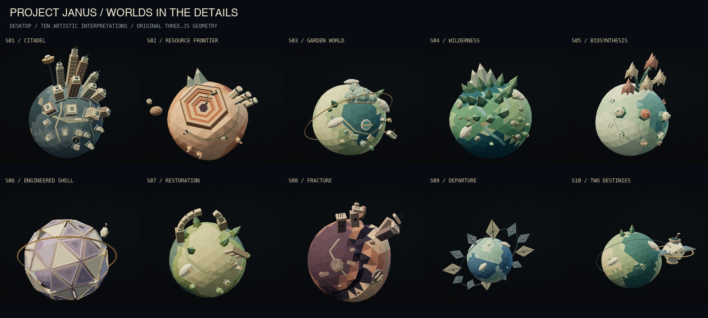

# Janus miniature worlds: detail v2

2026-09-07 · `codex/janus-first-light` · local production preview on port 3200.

The accepted low-poly direction is refined with smaller authored features on every planet.
The existing silhouettes, matte palettes, alien astronomer, enterable telescope and native
17-chapter scroll sequence remain the foundation. [Decision 014](../../DECISION_014_LOW_POLY.md)
records the direction and documentation reviewed; [v1 evidence](../low-poly/REPORT.md) is retained.

| World | Added modeled detail                                                                        |
| ----- | ------------------------------------------------------------------------------------------- |
| S1    | Floor bands, window mullions, roof equipment, low-rise blocks, roads and an elevated tram   |
| S2    | Quarry guardrails, excavator, crane, haul road, trucks and layered outcrops                 |
| S3    | Garden plots, pitched-roof houses, flowering trees, pool, bridge and station fittings       |
| S4    | Branching rivers, pale banks, cabins, plank bridge, fallen log and smaller vegetation       |
| S5    | Nursery ribs, root paths, rosette gardens and clusters of stemmed buds                      |
| S6    | Inset shell panels, vents, fasteners and an instrument mast                                 |
| S7    | Climbing vines, tiled plaza, cottages, returning trees and fallen masonry                   |
| S8    | Broken roads and bridge, reinforced hatches, exposed rebar, windows and rubble              |
| S9    | Structural sail ribs, central instrument buses, fittings and small natural surface features |
| S10   | Gridded solar arrays, station ports and windows, antenna, surface plots and paths           |

The opening illustrative Earth also gains a small river, capped ridges and islands. All added
geography, architecture and machinery are artistic inventions. They do not introduce scientific
values or alter scenario claims. DOM prose, labels, citations and accessible equivalents remain
authoritative for the story.

## Geometry and visual review

Roads, rivers and small settlement anchors project onto the actual flat terrain faces once at
construction. The detail geometry merges with existing landmarks into one static colored mesh per
world. There is no per-frame raycasting or per-feature draw call. The highest landmark count is
10,144 triangles on desktop and 8,104 on mobile, plus the existing 720/500-triangle terrain. Mobile
uses fewer tiny plants, low-rise blocks and fasteners while preserving identifying features.

All ten worlds were reviewed in the production [desktop](forms/worlds-contact.jpg) and
[portrait](forms/portrait-contact.jpg) captures. City crowns and habitat orbits retain their
framing; terrain routes follow the facets; cabins have actual pitched roofs; fine details remain
subordinate to the established silhouettes. The final capture set contains 28 chapter frames with
zero page/console errors, no overflow and successful telescope entry and return.

## Verification

- Production build and browser matrix: **166 passed, 4 intentional browser-specific skips** across
  Chromium, Firefox, WebKit and mobile Chromium/WebKit emulation. Includes rapid keyboard
  reversals, jump interruption, all worlds, observer, telescope, reduced motion, unavailable WebGL,
  context retry, disabled JavaScript, structured article and automated accessibility checks.
  [Run log](e2e.log).
- Vitest: **97 passed across 24 files**. Added a geometry regression check across all 11 worlds and
  both viewport tiers for finite attributes, deterministic construction, independent geometry,
  bounded size, one merged landmark mesh and triangle limits.
- ESLint, TypeScript, asset/source/canonical validators and generated-data reproducibility pass.
  The asset gate validates 48 rights records and every one of the 35 public asset files.
- [Production payload receipt](bundle-production.json): all configured payload caps pass.
- Production motion: **20 captures and zero runtime issues**. Forward/reverse scroll, stationary
  character movement, telescope entry/return, reduced-motion pixel stability, context-loss/retry
  and resize passed. The [desktop](motion/desktop-contact.jpg) and
  [portrait](motion/portrait-contact.jpg) sampled frames retain stable anatomy, planted feet,
  telescope grip and clear framing. [Motion receipt](motion/capture-report.json).
- Pinned Playwright 1.62.1 Noble/SwiftShader visual suite: **4 baseline-update checks passed, then
  4 unchanged comparisons passed**. Only the opening Earth baseline needed regeneration for its
  new detail. [Run log](visual-regression.log).
- Repository formatter, citation/link validator and `git diff --check` pass.

On Apple M4 Max / ANGLE Metal, sampled requestAnimationFrame cadence remained approximately
120 callbacks/second; p95 was 9.2–9.3 ms through forward/reverse world travel and stationary
observer motion. These local unthrottled measurements do not measure GPU presentation timing or
physical-phone performance. World geometry construction is staged outside continuous
animation; no new raycast work is performed during scrolling.

## Sources and handoff

Canonical release remains
`sha256:46a0e94a969301c49cfafe00463e5c7e9be5dce423ddcdeb21fe4ad0614d2046`.
Validation preserves 10 scenarios, 5 missions, 1,361 field provenance records and 120 cross-paper
cells. The existing published growth-rate discrepancy remains explicit and unreconciled.
Independent scientific review is still pending.

The original world artwork and poster are versioned as `janus.low-poly.worlds.v2` and
`janus.low-poly.origin-poster.v2`, with source/derivative checksums and transformation history in
the asset ledger. The original poster render is retained as
[origin-poster-source.png](forms/origin-poster-source.png). Observer and telescope remain at v1.
No new third-party artwork, package dependency or shared schema is introduced.

Files changed in this detail pass: new `PlanetDetails.ts`, `sculpture.ts` and
`world-geometry.test.ts`; revised `WorldStructures.tsx`, `Planet.tsx` and `Voyage.tsx`; versioned
fallback WebP; asset ledger; Decision 014, implementation status, affected visual baselines and
this QA packet. Earlier authorized frontend work remains on the same branch. No commit, push or
deployment is included. Physical-phone performance and manual assistive-technology certification
are not established by local emulation.
