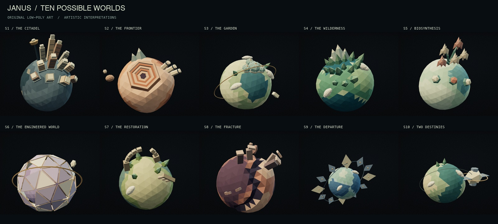

# Janus low-poly scene rebuild

2026-09-07 · `codex/janus-first-light` · local production preview on port 3200.

The homepage's spatial art is rebuilt from original geometry. Ten faceted miniature worlds,
an articulated alien astronomer, and an open telescope share a matte, limited-palette style.
The 17-chapter story, canonical data, native scroll navigation and accessible article remain
functional. [Decision 014](../../DECISION_014_LOW_POLY.md) records the direction and documentation reviewed.

## Art and motion review

| World | Distinctive artistic composition                                                 |
| ----- | -------------------------------------------------------------------------------- |
| S1    | Slate globe, stepped civic skyline and observation mast                          |
| S2    | Terracotta world, six-sided terraced quarry, silos and two small moons           |
| S3    | Greenhouse domes, garden settlements and a thin gold habitat orbit               |
| S4    | Conifer groves and a three-peak mountain range                                   |
| S5    | Branching botanical architecture, buds and hexagonal nurseries                   |
| S6    | Ivory and lavender triangular shell panels with open seams and a structural ring |
| S7    | Broken stone arch, colonnades and returning vegetation                           |
| S8    | Broad angular rift, broken towers and separated fragments                        |
| S9    | Small blue world inside an orderly constellation of kite-shaped sails            |
| S10   | Restored world beside a separate autonomous habitat                              |

These are artistic interpretations. Shapes, geography, landmarks and scale are invented, not
scientific reconstructions. The faceted base surfaces have at most 720 triangles on desktop and
500 on mobile. Static landmarks are merged into one colored mesh per world. Planet yaw stays
within a small range so landmarks remain visible during long reading pauses.

The new observer has a sculpted head, inset faceted eyes, antennae, coat, scarf, jointed arms,
hands, legs and boots. Breathing, blinking, head turns and wrist adjustments run while scrolling
is stationary. Feet stay planted and hands share the telescope's stage coordinates. The camera
enters the modeled open eyepiece; the view remains explicitly illustrative.

The animation quality gate was applied to both
[desktop](motion/desktop-contact.jpg) and [portrait](motion/portrait-contact.jpg) contact sheets.
The review checked all 16 sampled character frames for stable anatomy, legible expression,
planted feet, grip alignment, layer separation and framing. Initial review found cropped crowns,
overlong forearms, misaligned quarry terraces and crowded mobile labels. These were corrected
before the accepted production captures. Reduced motion freezes the canvas pixel-for-pixel.

## Verification

- Production-build Playwright matrix: **166 passed, 4 intentional browser-specific skips**, across desktop Chromium, Firefox, WebKit and mobile Chromium/WebKit emulation. Includes keyboard reversals, telescope entry/exit, navigation during travel, accessibility scans, complete article, disabled JavaScript, unavailable WebGL, retry and overflow checks. [Run log](e2e.log).
- Vitest: **96 passed across 23 files**. Planet geometry checks cover independent deterministic surfaces, finite coordinates/normals, triangle budgets and flat per-face colors/normals.
- Pinned Playwright 1.62.1 Noble/SwiftShader visual suite: **4 baseline updates passed, then 4 unchanged comparisons passed**. [Run log](visual-regression.log).
- Production art captures: **28 desktop/portrait chapter frames**, zero page/console errors; all ten worlds, opening, overview, observer and eyepiece reviewed. [Capture manifest](forms/capture.json).
- Production motion capture: **20 frames**, zero runtime issues, successful forward/reverse scroll, stationary character motion, telescope entry/return, reduced-motion freeze, context-loss recovery and resize. [Receipt](motion/capture-report.json).
- Formatter, ESLint, TypeScript, production build, asset/source/canonical/citation validators and generated-data reproducibility check pass. `git diff --check` passes.

Local requestAnimationFrame measurements on Apple M4 Max / ANGLE Metal stayed near 120 callbacks
per second, with approximately 9–10 ms p95 during the sampled transitions and observer pause.
This measures unthrottled local callback cadence, not GPU presentation timing or physical phone
performance. Exact measurements are retained in the motion receipt.

The [production bundle receipt](bundle-production.json) records the current initial JavaScript,
critical visual payload, deferred Three.js chunk and complete guided-path upper bound. All
configured payload caps pass.

## Sources, rights and handoff

Canonical release remains
`sha256:46a0e94a969301c49cfafe00463e5c7e9be5dce423ddcdeb21fe4ad0614d2046`.
Scientific content still resolves to the generated source records for arXiv:2409.00067v3,
arXiv:2511.20329v2 and the independently reimplemented collapse research. Validation reconciles
10 scenarios, 5 missions, 1,361 provenance fields and 120 cross-paper cells. The existing published
growth-rate discrepancy remains explicit.

The four `janus.low-poly.*.v1` ledger entries identify the original worlds, observer, telescope and
fallback poster, including AI assistance and source/derivative checksums. Asset validation passes
48 rights records and all 35 public asset files. No new downloaded third-party artwork or
package dependency was introduced. The fallback's unmodified source render is retained as
[origin-poster-source.png](forms/origin-poster-source.png).

Files changed for this pass: `apps/web/app/voyage/{Planet,WorldStructures,ObserverLife,Telescope,Space,Voyage}.tsx`,
`terrain.ts`, `terrain.test.ts`, `worlds.ts`, `voyage.module.css`; removed `organism-material.ts`;
new low-poly fallback WebP; asset ledger, decision/master/status documents, capture scripts,
visual snapshots and this QA packet. Earlier authorized frontend replacement changes on the
same branch remain in place. No commit, push or deployment is included.

Physical mobile-device and manual assistive-technology certification, field Core Web Vitals,
independent scientific review and deployment remain outside this local visual rebuild. The app
continues to disclose its canonical release's pending independent review.
