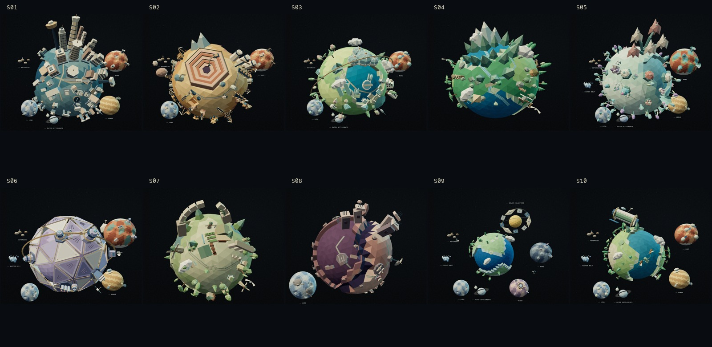

# Scenario identities and the worlds beyond Earth

2026-09-08 · `codex/janus-first-light` · local preview on port 3200.

This pass preserves the accepted low-poly direction and makes each scenario's culture and
system footprint easier to recognize. [Decision 016](../../DECISION_016_SCENARIO_IDENTITIES.md)
records the source reading and design boundary. The
[previous living-world pass](../living-worlds/REPORT.md) remains available.

## Narrative and original assets

Read the locked foundational paper, arXiv:2409.00067v3, including rendered page 11, and all ten
locked scenario pipelines. The resulting objects are original interpretations of narrative cues:

| Scenario | Distinctive local assets                                                                          | Selected system portrait                                                                                        |
| -------- | ------------------------------------------------------------------------------------------------- | --------------------------------------------------------------------------------------------------------------- |
| S1       | Faceted spires, paired residential slabs, stepped compounds, ration gates and surveillance drones | Luna, Mars, Venus orbital activity, asteroid industry and outer settlements                                     |
| S2       | Haulers, derricks, conveyors, reservoirs and cargo VTOLs around the quarry                        | Luna, Mars and asteroid mining                                                                                  |
| S3       | Civic pavilions, courtyard homes, terraces, glasshouses and ferries                               | Luna, Mars, asteroid mining and outer settlements                                                               |
| S4       | Seasonal camps, drying racks, small stores, canoes and mixed forest forms                         | Earth-centered portrait                                                                                         |
| S5       | Biosynthetic growth pods, organic arches, synthesis equipment and petal dwellings                 | Garden Mars, Luna, Venus atmospheric activity, asteroid/Kuiper industry and outer settlements                   |
| S6       | Reactors, radiators, manifolds and pressure-control assemblies                                    | Engineered Mars, Venus activity, Luna and asteroid/Kuiper operations                                            |
| S7       | Watermill, restoration workshop, cultivated beds, irrigation, seed storage and windmills          | Earth-centered portrait                                                                                         |
| S8       | Armored bunkers, salvage, broken dishes and damaged pylons                                        | Enlarged Luna with sheltered structures                                                                         |
| S9       | Sparse technological gifts and a quiet natural Earth                                              | Separate solar collectors, machine Mars, a distinct Venus aperture, lunar orbital activity and distant industry |
| S10      | Restrained surface settlement and an inhabited pressure cylinder with exposed green interior      | Luna, Mars, Venus, asteroid/Kuiper operations and outer settlements                                             |

Thirty-four object types replace repeating generic prop bands. Authored foreground clusters and
irregular seeded placements create different compositions. Vegetation has five constructed
growth forms. The main S1 skyline has four architectural silhouettes. Mining rocks, a fractured
Kuiper ice body, ringed outer-system context and the S9 solar collectors are separate geometries.

The system portraits are not orbit diagrams. All dimensions, counts, colors, buildings, terrain
and positions are interpretive, and their sizes/distances are not to scale. The published
footprint is selected and non-exhaustive; an unlisted or null cell never establishes absence of
technology. Positive generated Table 6 cells select named bodies and the type of activity;
positive Table 8 rows select extended system activity. Exact SourceRefs stay in the server-side
view. DOM source links and accessible prose remain available without WebGL or JavaScript.

Mobile chapter anchors now follow the start of their prose instead of the midpoint of a
variable-height article. This keeps the art and labels above the text when source links wrap.
Shorter mobile viewports also reserve headroom for S9's solar vignette. The native scroll,
keyboard/reversal contract, character performance and enterable telescope remain in place.

## Geometry and provenance

The [geometry receipt](geometry-budget.json) records both viewport tiers. The largest main-world
landmark mesh is 12,580 triangles, below the prior pass's 18,244. The largest combined companion
system is 6,888 triangles; the maximum terrain + landmarks + companions is 19,508 triangles.
Small moving craft are additional separate meshes. Static assemblies remain merged, geometry
is finite and reproducible, all resources are disposed, and offscreen systems stop animating.
The opening canvas is pixel-identical to its accepted v3 capture.

Canonical release is unchanged:
`sha256:46a0e94a969301c49cfafe00463e5c7e9be5dce423ddcdeb21fe4ad0614d2046`.
Source validation verifies all 15 locked checksums. Data validation retains 10 scenarios,
5 missions, 1,361 exact provenance records, 120 reconciled cross-paper cells and 27 generated
files. The published growth discrepancy remains separately reported. Independent scientific
review remains pending.

No pipeline PDF, third-party model or reference pixels are bundled. The ledger's original art
entry is `janus.low-poly.worlds.v4`; its checksum covers the ordered modeling/staging source
files listed in that entry. Observer v2, telescope v1 and opening poster v3 are retained. Asset
validation passes 48 rights records and 36 derivative records across 35 public files. No
dependency or shared schema change is made.

## Verification

Lint, TypeScript and 103 unit tests across 27 files pass. New tests verify positive canonical
selection, exact Table 6/8 locators, different companion geometry, finite buffers and geometry
budgets. Source, generated-data reproducibility, canonical-data, asset and citation validators
pass. The production build prerenders all 28 pages.

- The production [browser matrix](e2e.log) passes **166 tests with 4 intentional browser-specific
  skips** across Chromium, Firefox, WebKit and mobile Chromium/WebKit emulation. This includes
  complete footprint lists, label bounds, keyboard/reversal, all ten worlds, the telescope,
  reading mode, unavailable WebGL, disabled JavaScript and automated WCAG checks.
- [Production portrait captures](forms/capture.json): **28 frames, zero page/console errors**,
  no page overflow, successful eyepiece entry/return. The
  [desktop](forms/worlds-contact.jpg) and [phone](forms/portrait-contact.jpg) contact sheets were
  reviewed. The [opening comparison](forms/origin-comparison.json) is pixel-identical.
- [Motion QA](motion/capture-report.json): **44 captures, zero runtime issues**, identical reduced
  canvas pixels, successful context retry/resize, and forward/reverse scroll returning to its
  starting position. The [desktop](motion/desktop-contact.jpg) and
  [portrait](motion/portrait-contact.jpg) actor contacts cover the full observing/gesture cycle.
  Anatomy, planted feet, hand contact and telescope framing remain stable.
- Four unthrottled six-second native samples on Apple M4 Max / ANGLE Metal measured about
  **120 requestAnimationFrame callbacks/second**, p95 intervals **8.9–9.3 ms**, and a longest
  interval of **9.4 ms**. These measure local callback cadence, not GPU presentation timing,
  physical-phone performance or field Core Web Vitals.
- [Payload gates](bundle-production.json) pass: initial home JavaScript **187,100 / 256,000 gzip
  bytes**, critical visuals **135,976 bytes**, and conservative guided-path upper bound
  **11,711,517 / 20,971,520 bytes**. The [original-art checksum](art-source.json) is verified.
- Repository formatting and `git diff --check` pass. The in-app preview was opened on S5 with
  stage status `ready` and Full motion selected.

**Pinned Linux screenshot comparison is incomplete.** Its reading-mode baseline update passed
and the actual rendered image was inspected. The subsequent four-test comparison produced no
results after Docker Desktop's local API returned HTTP 500; `ps`, `inspect` and stopping this
test container timed out. The stalled host test client was terminated. Container cleanup could
not be confirmed while the API was unresponsive; no global Docker restart was performed.
[Environment receipt](visual-environment.json), [baseline update](visual-reading-update.log)
and [incomplete comparison log](visual-regression.log). The former Linux baselines for the
opening, Atlas and Observatory remain unchanged; this pass does not claim a successful final
Linux pixel comparison.

The initial browser pass caught insufficient spacing between the new source links; they now
have at least 28px-tall click targets. A subsequent shorter iPhone viewport exposed the solar
label entering the header. Framing was corrected, with assertions for every selected label's
visibility, viewport bounds and clearance from the chapter copy.

## File handoff

- New original art: `ScenarioObjects.ts`, `ScenarioBiomes.ts`, `SystemGeometry.ts`,
  `WorldSystem.tsx` under `apps/web/app/voyage/`.
- Refined existing art: `WorldBiomes.ts`, `WorldStructures.tsx`, `PlanetDetails.ts`,
  `WorldActivity.tsx`, and scene staging in `Space.tsx`.
- Data view and tests: `apps/web/lib/system-portrait.ts`, `system-portrait.test.ts`, and
  `apps/web/app/voyage/system-geometry.test.ts`.
- Story and navigation: `apps/web/app/page.tsx`, `Voyage.tsx`, `voyage.module.css`,
  `apps/web/e2e/story.spec.ts` and `cinematic.spec.ts`.
- Delivery: asset ledger, Decision 016, master plan, implementation status, reading-mode visual
  baseline and this evidence packet.

No commit, push or deployment is included. Physical-phone performance, field Core Web Vitals
and manual assistive-technology certification remain outside this local verification. Existing
scientific-review and public-release gates retain their prior status.
